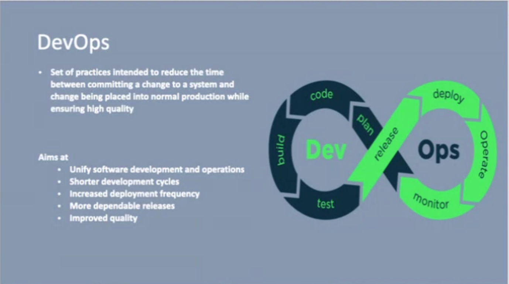

# 28th October

## Revision

Virtual Machine from AWS is called EC2 instance.

- VPC (Virtual Private Cloud) -
    - Personal Private space in AWS
    - There can be subnets in VPC
    - The subnets are connected to an internet gateway (IGW) to be public subnets.
    - The subnets don't need an IGW to interact with each other.
    - We implement security at different levels, it's called Layered Security.
    
Load Balancer on Public Subnet -> Authorization/Authentication Service -> Microservice 1 -> Load Balancer -> Microservice 2
 
        |
        V
     Message Broker 
     
        |
        V
     Microservice 3  

### Communication 
- Synchronous 
- Asynchronous
    - Message Queue
    - PubSub 

## DevOps

Set of 
- Practice
- Philosophies
- Tools

Toughest part of Devops is Philosophy.

**Linting is the process of using a linter, a static code analysis tool, to automatically check source code for errors, bugs, stylistic issues, and suspicious constructs.**

### Shift Left Approach

In SDLC, there's Requirement gathering stage -> Design phase -> Coding Phase -> Testing Phase -> Release

In Shift Left approach, we move the testing phase to the left, so we test as early as possible. 

## Security Testing

- SCA - Software Compliance Analysis
- SAST - Static Application Security Testing
- DAST - Dynamic Application Security Testing

---

- SCA and SAST are done in the coding phase.
- DAST is done in the testing phase.

---

- SCA checks for compliance with security policies.
- SAST checks for security vulnerabilities in the code.
- DAST checks for security vulnerabilities in the application.

## Continuous Deployment vs Continuous Delivery

Continuous Deployment (CD) and Continuous Delivery (CD) are both part of DevOps, but they differ in their approach.

- Continuous Deployment (CD) means that every change to the codebase is automatically built, tested, and deployed to production.
- Continuous Delivery (CD) means that for every change to the codebase, a new version of the software can be built and tested, and if the tests pass, it can be automatically deployed to production. But there's a manual approval step before the deployment.

In summary, CD is more aggressive than CDL, because it automatically pushes changes to production, while CDL pushes changes to production with a manual approval step.

## SonarQ

SonarQ (commonly called SonarQube) is an open-source platform developed by SonarSource that is used for continuous inspection of code quality.

It generates a report/dashboard showing:
- Bugs 
- Code Smells (bad practices that might cause future issues)
- Vulnerabilities 
- Duplications 
- Test coverage 

# Why is Nexus better than ECR and ACR ?